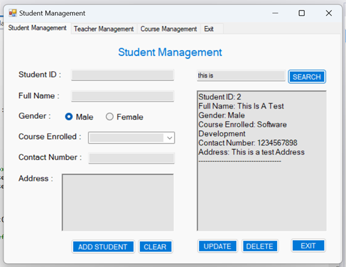

# School Management System
This repository showcases a School Management System application programmed using C#

## Context

## Table of Contents
- [School Management System](#school-management-system)
- [Context](#table-of-contents)
- [Table of Contents](#table-of-contents)
- [School Management System](#school-management-system-1)

## School Management System
### Overview
Design and implement a Windows Forms application for a school management system. The application should provide functionality for managing student and teacher information, as well as handling course enrolments and grading. It should include the following features:

#### Student Management:
- Ability to add new students to the system. 
- Ability to edit student details such as name, contact information, and grade level. 
- Ability to delete students from the system. 
- Ability to search for students by name or student ID. 
- Create a corresponding table in the SchoolManagementSystem Database called StudentDetails.
    

#### Teacher Management:
- Ability to add new teachers to the system. 
- Ability to edit teacher details such as name, contact information, and subject specialization. 
- Ability to delete teachers from the system. 
- Ability to search for teachers by name or teacher ID. 
- Create a corresponding table in the SchoolManagementSystem Database called TeacherDetails. 
    

#### Course Management:
- Ability to create new courses with a title, description, and associated teacher. 
- Ability to edit course details such as title, description, and assigned teacher. 
- Ability to delete courses from the system. 
- Ability to search for courses by title or course ID. 
- Create a corresponding table in the SchoolManagementSystem Database called CourseDetails. 
    

#### User Sign-Up and Login Interface:
- The application should have an intuitive and user-friendly interface with appropriate controls (textboxes, buttons, etc.) for each functionality. 
- The user interface should provide clear instructions and feedback to guide the user in performing the desired actions. 
- The user can register their username and password and the details should be saved to a table in your SQL Database called UserDetails. 
- The Signup interface should look like the figure below:
    
- The Login interface should look like the figure below. 
- To log in, the details used should match the credentials in the Database to provide access to the School Management System. Appropriate messages should be displayed if a user logs in with a Wrong Password and or Username or tries to log in without entering either the Username or Password (Message Box showing, enter Username or Password). 
    

#### Considerations:
- Implement appropriate data structures and classes to represent students, teachers, courses, and their relationships. 
- Use proper validation techniques to ensure data integrity and handle potential errors. 
- Implement suitable search and filtering mechanisms to enhance the usability of the application. 
- Apply good coding practices, such as following naming conventions, organizing code into logical modules, and commenting where necessary. 
- Implement error handling and exception management to provide a robust application. 

#### Database with all the required tables:
- UserDetails
- StudentDetails
- TeacherDetails
- CourseDetails
   

### Demonstrating functionality

When the application first runs, the user will be on the Sign Up form and they will have to sign up: 
  

The show password checkbox will allow the user to see the password they are entering: 
  

If the passwords do not match, error handling takes place and lets the user know to enter the passwords correctly: 
  

Also, if there is no username or if the user already signed up previously, the appropriate message would pop up: 
  

Upon Successful registration, the user will be redirected to the Login page: 
  

Error handling for if the username or password is invalid: 
  

Upon successful login, the user will be redirected to the student management form: 
  

The user can add a student:
  

The user can also search for a student: 
  

The user can update a student’s details: 
  

Updated Student details: 
  

User can delete a student: 
  

Search for all students: 
  

The same applies for the Teacher Management tab, the user can add a new teacher, clear the form, edit teacher details, delete a teacher and search for teachers: 
  

The same applies for the Course Management tab, the user can add a new course, clear the form, edit a course details, delete a course and search for a course. The exit button will exit the application: 
  

Finally, the Exit tab, the exit button will exit the application:
  
