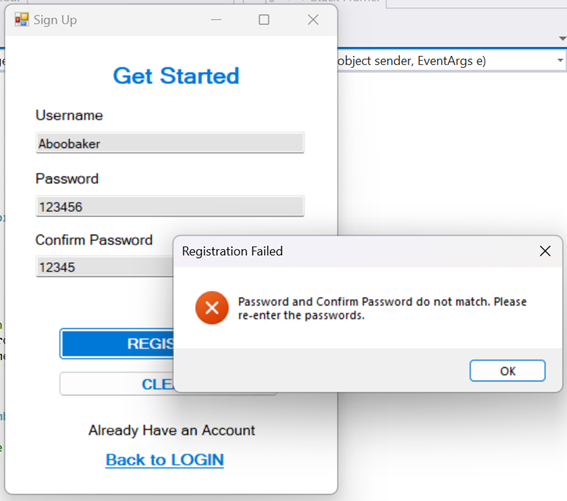

# School Management System
This repository contains a School Management System application developed in C#. The application is designed to streamline the management of students, teachers, courses, and user authentication within a school environment.

## Context
The School Management System is a Windows Forms application that aims to simplify the administration of a school by providing a user-friendly interface for managing key entities such as students, teachers, and courses. The system also includes robust user authentication features, allowing for secure access to the system. The project is ideal for educational institutions seeking a basic yet effective tool to manage their operations.

## Table of Contents
- [School Management System](#school-management-system)
- [Context](#context)
- [Table of Contents](#table-of-contents)
- [Overview](#overview)
- [Student Management](#student-management)
- [Teacher Management](#teacher-management)
- [Course Management](#course-management)
- [User Sign-Up and Login Interface](#user-sign-up-and-login-interface)
- [Considerations](#considerations)
- [Database Tables](#database-with-all-the-required-tables)
- [Demonstrating Functionality](#demonstrating-functionality)

## Overview
This project involves designing and implementing a Windows Forms application for a school management system. The application provides functionality for managing student and teacher information, as well as handling course enrollments and grading. It includes the following features:

### Student Management:
- Add new students to the system.
- Edit student details such as name, contact information, and grade level.
- Delete students from the system.
- Search for students by name or student ID.
- Create a corresponding table in the SchoolManagementSystem database called `StudentDetails`.
    

### Teacher Management:
- Add new teachers to the system.
- Edit teacher details such as name, contact information, and subject specialization.
- Delete teachers from the system.
- Search for teachers by name or teacher ID.
- Create a corresponding table in the SchoolManagementSystem database called `TeacherDetails`.
    

### Course Management:
- Create new courses with a title, description, and associated teacher.
- Edit course details such as title, description, and assigned teacher.
- Delete courses from the system.
- Search for courses by title or course ID.
- Create a corresponding table in the SchoolManagementSystem database called `CourseDetails`.
    

### User Sign-Up and Login Interface:
- The application includes an intuitive and user-friendly interface with appropriate controls (textboxes, buttons, etc.) for each functionality.
- The user interface provides clear instructions and feedback to guide the user in performing the desired actions.
- Users can register their username and password, with details saved in a table in your SQL database called `UserDetails`.
       
- The login interface allows users to authenticate based on credentials stored in the database. Appropriate messages are displayed for incorrect login attempts or missing credentials.
    

### Considerations:
- Implement appropriate data structures and classes to represent students, teachers, courses, and their relationships.
- Use proper validation techniques to ensure data integrity and handle potential errors.
- Implement suitable search and filtering mechanisms to enhance the usability of the application.
- Follow good coding practices, such as naming conventions, organizing code into logical modules, and adding comments where necessary.
- Implement error handling and exception management to create a robust application.

### Database with all the required tables:
- `UserDetails`
- `StudentDetails`
- `TeacherDetails`
- `CourseDetails`
   

### Demonstrating functionality

When the application first runs, the user will be directed to the Sign-Up form to create an account:
  

The "Show Password" checkbox allows users to see the password they are entering:
  

If the passwords do not match, error handling alerts the user to enter the passwords correctly:
  

Appropriate messages will also appear if there is no username or if the user has already signed up previously:
  

Upon successful registration, the user is redirected to the Login page:
  

Error handling for invalid username or password:
  

Upon successful login, the user is redirected to the Student Management form:
  

The user can add a student:
  

The user can also search for a student:
  

The user can update a student’s details:
  

Updated student details:
  

The user can delete a student:
  

Search for all students:
  

The same functionalities apply for the Teacher Management tab, where users can add, edit, delete, and search for teachers:
  

The same applies for the Course Management tab, where users can manage courses. The exit button will close the application:
  

Finally, the exit button on the Exit tab will close the application:
  
